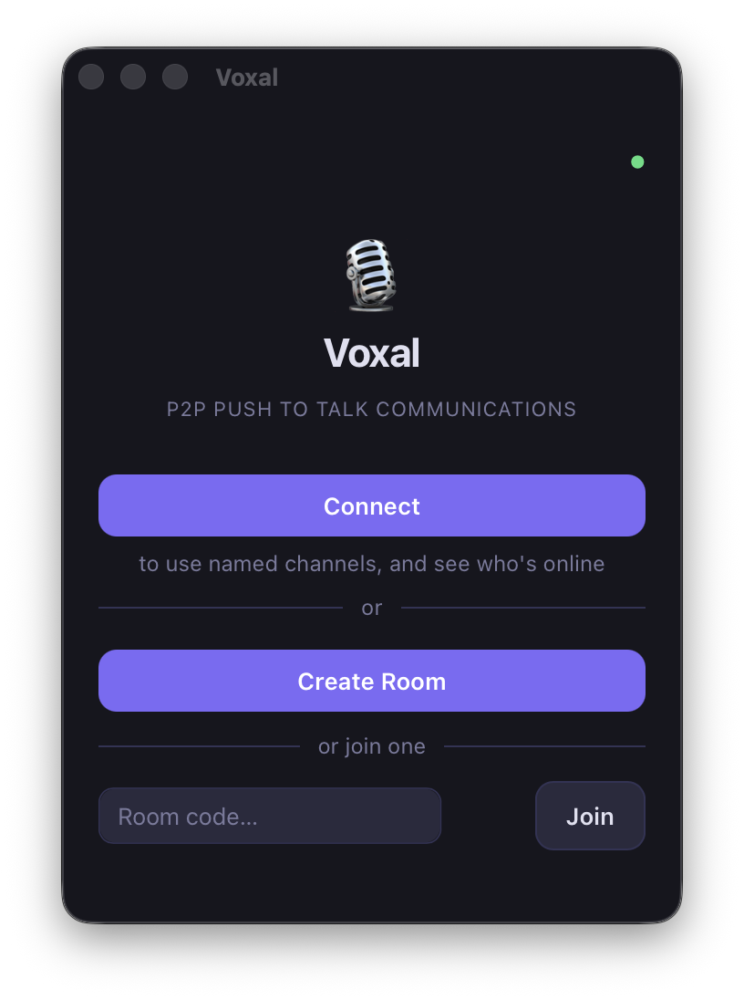

# Voxal

> Serverless push-to-talk voice chat for desktop, mobile, and browser — no accounts, no central server, just a room code.



---

## Features

- 🎙 **Push-to-talk** — hold a configurable keyboard shortcut (desktop) or tap-and-hold the mic button (mobile/web) to transmit
- 🔓 **Free-hand mode** — toggle always-on mic when you don't want to hold a key
- 🔑 **Private rooms** — share a room code; only people with the code can join
- 👤 **Pseudonyms** — pick a nickname that shows in the participant list
- 🟢 **Talking indicator** — speaking participants are highlighted in real time
- 🔔 **Audio cues** — synthesized sounds for PTT on/off, peer join, and peer leave
- 📹 **Video & screen sharing** — optional camera and screen share per participant
- 🎛 **Noise suppression** — RNNoise WASM or browser-native noise cancellation
- 🖥 **Desktop + mobile + web** — native Tauri app, Capacitor iOS/Android app, or a plain static web page
- 🍎 **iOS Dynamic Island PTT** — system-level push-to-talk button via `PushToTalkUI`
- 🔄 **Auto-updater** — built-in update check on Tauri desktop (signed releases)
- 🔗 **Optional presence** — connect a Voxal account to see org channels and online status
- ☁️ **No mandatory server** — P2P audio via WebRTC; only the PeerJS free signaling tier is required

---

## Architecture

```
Signaling topology   :  star  — host ↔ each peer via PeerJS DataConnection
Audio topology       :  mesh  — every peer ↔ every peer via WebRTC MediaConnection
Codec                :  Opus (browser default for WebRTC), 16 kHz mono
Signaling server     :  PeerJS public server (0.peerjs.com) — free tier, ~50 users/IP
```

### How a room works

1. **Host** creates a room → PeerJS assigns them a peer ID (this *is* the room code)
2. **Joiner** enters the room code → connects to host via DataConnection, sends `hello { pseudo }`
3. Host replies with the full peer list, then broadcasts `peer-joined` to all existing peers
4. Everyone connects to everyone else directly over WebRTC for audio (full mesh)
5. Talking state is relayed through the host's data channel so all participants see who's speaking
6. When the host leaves, peers elect a new host by following the authoritative successor chain published in every `peer-list` and `heartbeat`; audio is uninterrupted

### Data protocol

| Message | Direction | Payload |
|---|---|---|
| `hello` | joiner → host | `{ pseudo }` |
| `peer-list` | host → joiner | `{ peers:[{id,pseudo}], hostId, hostPseudo, deputyId, successorIds }` |
| `peer-joined` | host → all | `{ peerId, pseudo }` |
| `peer-left` | host → all | `{ peerId }` |
| `peer-renamed` | host → all | `{ peerId, pseudo }` |
| `talking` | peer → host → all | `{ peerId, active }` |
| `heartbeat` | host ↔ peers | `{ at, deputyId, successorIds }` |
| `redirect` | peer → misdirected joiner | `{ hostId, hostPseudo }` |
| `room-published` | host → all | `{ roomId }` |
| `video-offer` | peer → host (relayed) | `{ peerId }` |
| `video-stop` | peer → host (relayed) | `{ peerId }` |

---

## Stack

| Layer | Technology |
|---|---|
| Desktop shell | [Tauri 2](https://v2.tauri.app) (Rust + WebView) |
| Mobile shell | [Capacitor 8](https://capacitorjs.com) (iOS + Android) |
| Frontend | Vanilla HTML / CSS / JS — no framework, no build step |
| P2P signaling | [PeerJS 1.5](https://peerjs.com) — bundled locally (`src/assets/peerjs.min.js`) |
| Audio | WebRTC `getUserMedia` + Opus |
| Noise suppression | RNNoise WASM / browser constraints |
| Audio feedback | Web Audio API (synthesized, no audio files) |
| Global shortcut | `tauri-plugin-global-shortcut` (desktop only) |
| Auto-updater | `tauri-plugin-updater` (desktop only) |
| Deep links | `tauri-plugin-deep-link` / `CFBundleURLSchemes` (`voxal://`) |

The desktop binary is ~10–20 MB. The web version is a handful of static files.

---

## Prerequisites

| Tool | Version |
|---|---|
| Node.js | ≥ 18 |
| Rust | stable (via [rustup](https://rustup.rs)) |
| Tauri CLI | installed via `npm install` |

On macOS you also need Xcode Command Line Tools (`xcode-select --install`).
On a blank Mac, install Xcode Command Line Tools first, then Node.js, then Rust.

---

## Getting started

```sh
# Install all dependencies (npm + Rust crates)
make install

# Start the desktop app in dev mode (hot reload)
make dev

# Or serve the web version locally
make run-web           # → http://localhost:8080
```

If `make install` reports that a tool is missing, follow the printed guidance and rerun it.

---

## All Makefile targets

```
make help          Show this list
make dev           Tauri hot-reload dev mode
make run           Build & launch the desktop release binary
make build         Full Tauri release build
make build-debug   macOS debug bundle (registers voxal:// URL scheme)
make build-signed  Release build with signing key (for auto-updater)
make release       Build + tag + publish GitHub release (auto-bumps patch by default)
make run-web       Serve src/ on http://localhost:8080
make build-web     Copy src/ to dist/ for static hosting
make cap-sync      Sync src/ assets to iOS & Android
make cap-ios       cap-sync + open Xcode
make cap-android   cap-sync + open Android Studio
make install       npm install + cargo fetch
make check         Rust type-check without building
make clean         Remove Cargo build artifacts and dist/
make docs          Serve architecture docs on http://localhost:8090
```

Release versioning shortcuts:

```sh
# Auto-bump patch (e.g. 1.0.0 -> 1.0.1), sync files, build and release
make release

# Or force an explicit version
make release VERSION=1.2.0
```

`make release` publishes the macOS artifacts locally. A separate GitHub Actions workflow (`Release Windows build`) is triggered on release publish to build and upload Windows installers to the same release.
During `make release`, the version is synchronized in `package.json`, `src-tauri/tauri.conf.json`, `src-tauri/Cargo.toml`, and `src/version.js` (with an updated build date) so updater checks and web About metadata stay consistent.
The Windows workflow requires repository secrets `TAURI_SIGNING_PRIVATE_KEY_PASSWORD` and either `TAURI_SIGNING_PRIVATE_KEY` (full minisign private key text) or `TAURI_SIGNING_PRIVATE_KEY_B64` (base64-encoded key file).

> **macOS URL scheme note:** `make dev` cannot register the `voxal://` custom scheme — it requires a signed `.app` bundle. Run `make build-debug` once and open the resulting `.app` to register it; the registration persists when you switch back to `make dev`.

---

## Deploying the web version

The `src/` folder is a self-contained static web app — no bundler, no build step.

```sh
# Copy to dist/
make build-web

# Then deploy dist/ to any static host, for example:
npx netlify deploy --dir dist
# or drag dist/ into Netlify/Vercel/GitHub Pages
```

> **Note:** the web version requires the page to be served over **HTTPS** (or `localhost`) for `getUserMedia` microphone access.

A `vercel.json` is included that sets the required `Cross-Origin-Opener-Policy` / `Cross-Origin-Embedder-Policy` headers (needed for `SharedArrayBuffer` / RNNoise WASM).

---

## Mobile (Capacitor — iOS & Android)

The `src/` web app is wrapped as a native mobile app via [Capacitor](https://capacitorjs.com). All Tauri-specific calls are guarded with `if (window.__TAURI__)` and silently no-op on mobile.

### Prerequisites
- **iOS:** Mac + Xcode + Apple Developer account (for device builds)
- **Android:** Android Studio

### Workflow

```sh
# After any change to src/, sync assets to both platforms
make cap-sync

# Open in Xcode (then build/run from there)
make cap-ios

# Open in Android Studio (then build/run from there)
make cap-android
```

> **Important:** every change to `src/` must be manually synced to `ios/App/App/public/` and `android/app/src/main/assets/public/` (or via `make cap-sync`) before building.

### What works on mobile
- Full P2P room creation and joining
- Push-to-talk via tap-and-hold on the mic button
- iOS system-level PTT via Dynamic Island (`PushToTalkUI` framework)
- Free-hand mode toggle
- Pseudonyms and talking indicators
- Audio cues and haptic feedback on PTT
- Noise suppression
- Deep links (`voxal://`) for room sharing

### What's different vs desktop
- No global keyboard shortcut (mobile has no background keyboard access) — PTT is touch-only
- Hardware keyboard Space/Enter shortcuts work if a keyboard is connected

### Forking / building your own iOS app

If you fork this repo and want to build the iOS app under your own Apple Developer account, you need to update three places:

1. **`capacitor.config.json`** — change `appId` to your own bundle ID (e.g. `com.yourname.voxal`)
2. **Xcode project** — open `ios/App/App.xcodeproj`, update the bundle identifier in *Signing & Capabilities* to match
3. **`src/.well-known/apple-app-site-association`** — replace `RFJ383NTK7.com.erwann.voxal.app` with `<YOUR_TEAM_ID>.<your.bundle.id>` so Universal Links route to your build

Without step 3, tapping a room invite link on iOS will open the web page instead of the app.

### Forking / building your own Android app

Android App Links (HTTPS deep links) are enabled via `src/.well-known/assetlinks.json`. If you fork this repo and build under your own signing key:

1. Generate your release keystore:
   ```sh
   keytool -genkey -v -keystore ~/.android/your-release.jks -alias your-alias \
     -keyalg RSA -keysize 2048 -validity 10000
   ```
2. Create `android/keystore.properties` (gitignored) with `storeFile`, `storePassword`, `keyAlias`, `keyPassword`
3. Get your SHA-256 fingerprint:
   ```sh
   keytool -list -keystore ~/.android/your-release.jks -storepass <password>
   ```
4. Replace the `sha256_cert_fingerprints` value in `src/.well-known/assetlinks.json` and update `package_name` if you changed the bundle ID
5. Deploy → Vercel serves the updated file

Build a signed AAB for Google Play with `make build-android`.

---

## Push-to-talk

### Desktop (Tauri)
The global shortcut works **even when the app is in the background**. Default: `Shift+Space`. You can change it inside the app — press the **Edit** button next to the shortcut display, then press your desired key combination.

### Web (browser)
PTT only works when the **tab is focused** (browser security limitation). Default shortcut: `Space`.

### Free-hand mode
Click the **Free hand OFF/ON** button to keep your mic permanently open without holding any key.

---

## Audio cues

All sounds are synthesized via the Web Audio API — no audio files are bundled.

| Event | Sound |
|---|---|
| PTT activated | Short rising chirp (880 Hz → 1200 Hz) |
| PTT released | Short falling chirp (800 Hz → 500 Hz) |
| Peer joins room | Ascending triad chime (C5 → E5 → G5) |
| Peer leaves room | Descending fifth (G5 → C5) |

---

## Optional presence / channels

Voxal can optionally connect to a presence backend to show org channels and online status. This is entirely opt-in — the app works fully without it.

The default hosted instance is `https://vybzjzwsqrggatcrnqxe.supabase.co/functions/v1/session`. You can override the URL in Settings → Advanced to point at your own deployment, or leave the token field empty to use Voxal in pure peer-to-peer mode.

---

## Project structure

```
voxal/
├── src/                          # Frontend — shared by desktop, mobile, and web
│   ├── index.html                # App shell (home, room, error screens)
│   ├── main.js                   # All app logic (no framework)
│   ├── styles.css                # Dark/light theme, responsive layout
│   ├── settings.html             # Preferences page (Tauri window / in-app modal)
│   ├── screen-popup.html         # Screen share pop-out window
│   ├── video-popup.html          # Video pop-out window
│   ├── devlog.html               # Dev log pop-out window
│   └── assets/
│       └── peerjs.min.js         # PeerJS bundled locally (no CDN)
├── src-tauri/                    # Tauri / Rust backend
│   ├── src/
│   │   ├── lib.rs                # IPC commands + global shortcut + PTT events
│   │   └── main.rs               # Entry point
│   ├── Cargo.toml
│   ├── tauri.conf.json
│   ├── Info.plist                # macOS usage descriptions (mic, camera)
│   ├── entitlements.plist
│   └── capabilities/
│       └── default.json          # IPC permissions
├── ios/                          # Capacitor iOS project
├── android/                      # Capacitor Android project
├── KNOWLEDGE/                    # Development notes and gotchas (not shipped)
│   ├── learning.md
│   ├── todos.md
│   └── universal-links-aasa.md
├── docs/                         # Architecture diagrams
├── capacitor.config.json
├── vercel.json
├── Makefile
└── package.json
```

---

## Known limitations

- **NAT traversal** — PeerJS uses Google's STUN servers by default. Users behind very strict NAT/firewalls may fail to connect. For maximum reliability, configure a TURN server in Settings → Advanced.
- **PeerJS free tier** — `0.peerjs.com` allows ~50 simultaneous connections per IP. For larger groups or production use, [self-host the PeerJS server](https://github.com/peers/peerjs-server).
- **Browser PTT scope** — the keyboard shortcut only fires when the tab is focused (browser security limitation). Click-and-hold the mic button always works.
- **Room persistence** — rooms exist only while at least one participant remains. When the host disconnects, the remaining peer designated as deputy is automatically promoted; audio MediaConnections are never torn down during the handoff.

---

## License

MIT — see [LICENSE](LICENSE).
