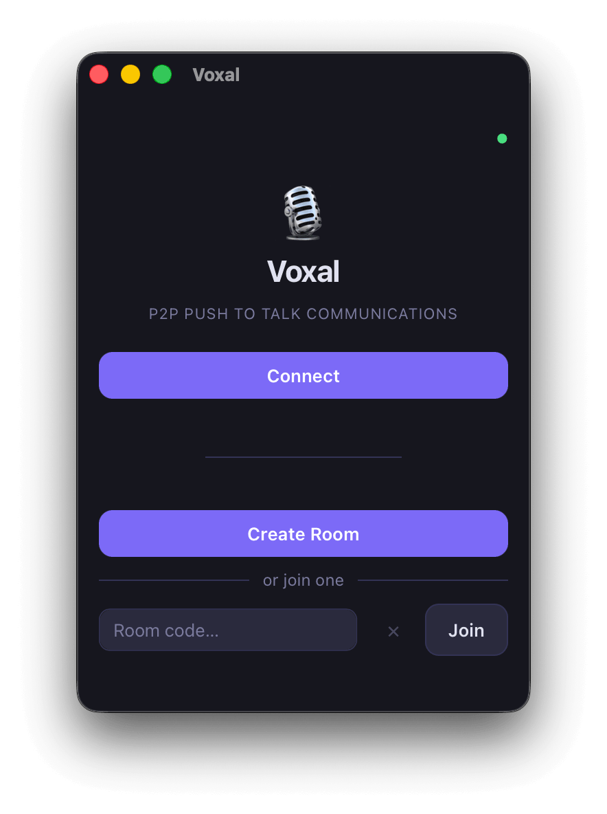
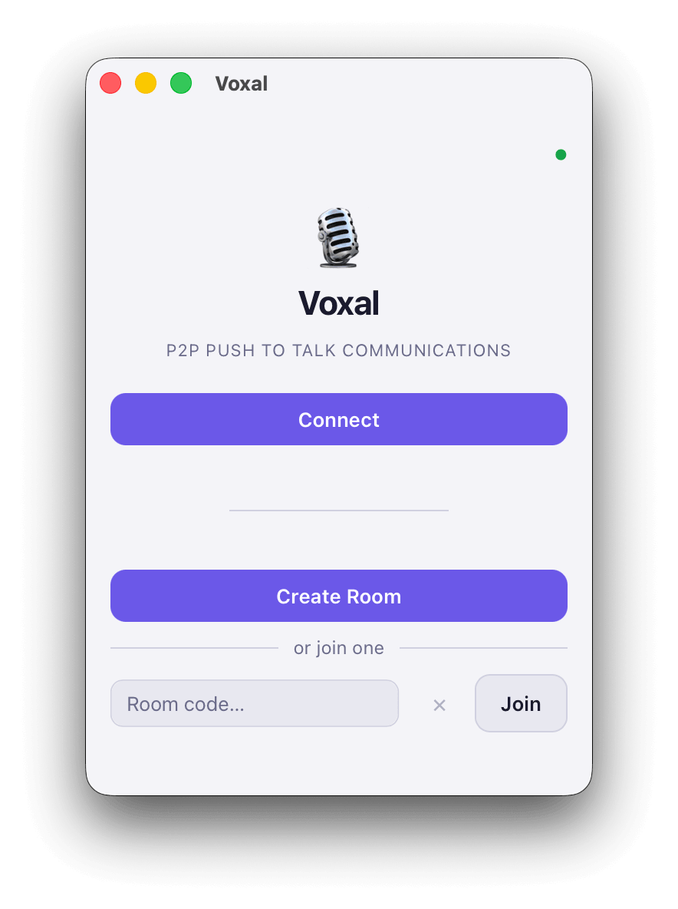

# Voxal

[](LICENSE)
[](https://github.com/ErwannRobin/Voxal/releases)
[](https://github.com/ErwannRobin/Voxal/actions/workflows/tests.yml)


Instant push-to-talk voice rooms.
No accounts. No installation. No server required.

<details>
<summary>Screenshots</summary>

| Dark | Light |
|---|---|
|  |  |

</details>

## Get Started

🌐 [Try in a browser](https://web.voxal.app)

💻 [Download Desktop App](https://github.com/ErwannRobin/Voxal/releases/latest)

📡 [Join the Presence Portal](https://voxal.app)

## Why Voxal?

- **Pure P2P voice** (WebRTC full-mesh audio)
- **Push-to-talk first** UX on every platform
- **Host migration** keeps rooms alive when the host leaves
- **No account required** to create or join rooms
- **No mandatory backend** (optional presence only)
- **Desktop + iOS + Android + Web** from one shared frontend
- **Open source** and **self-hostable signaling** for production control

## Features

### Main features

 - **Peer-to-peer voice conversation** - WebRTC audio mesh (Opus)
 - **TURN / STUN support** - for [NAT/firewalls](https://en.wikipedia.org/wiki/Traversal_Using_Relays_around_NAT) traversal
 - **Push-to-talk with background mode** - Global shortcut on desktop; touch PTT on mobile/web
 - **Room keep-alive via host migration** - Deputy/successor handoff with authoritative peer lists
 - **Multi-platform support** - Web, macOS/Linux/Windows (Tauri), iOS/Android (Capacitor)

### Experimental features

 - **Video sharing** - Optional per participant
 - **Screen sharing** - Optional per participant
 - **Dynamic Island PTT (iOS)** - Uses PushToTalkUI integration

## Use Cases

- Gaming communities
- Remote teams and standups
- Event staff coordination
- Family voice rooms
- Temporary project channels
- Lightweight emergency communication

## Architecture Overview

```text
Signaling topology : star  (host ↔ peers via PeerJS DataConnection)
Audio topology     : mesh  (peer ↔ peer via WebRTC MediaConnection)
Codec              : Opus (16 kHz mono)
```

Room flow (high level):
1. Host creates a room (host PeerJS ID becomes the room join target).
2. Joiners connect to the host signaling channel and receive peer state.
3. Peers open direct audio links to each other.
4. If host disconnects, successor/deputy migration elects a new host without dropping active media links.

For protocol messages, room lifecycle, stack details, and project layout, see [docs/architecture.md](docs/architecture.md).

## Documentation

- [Architecture & protocol](docs/architecture.md)
- [Host migration deep dive](docs/host-migration.md)
- [Deployment & self-hosting](docs/deployment.md)
- [Mobile build and fork guide (iOS/Android)](docs/mobile.md)
- [Release workflow and signing](docs/release.md)
- [iframe embed parameters and bridge](docs/iframe-embed.md)
- [Recent daily updates](docs/updates/2026-06-15.md)

## Contributing

Contributions are welcome. For local development:

```bash
git clone https://github.com/ErwannRobin/Voxal.git
make install
make dev
make test
```

If you modify files under `src/`, sync assets for mobile builds with `make cap-sync`.

| Command | What it does |
|---|---|
| `make install` | Installs Node deps and fetches Rust crates (with setup preflight checks) |
| `make dev` | Starts the Tauri desktop app with hot reload |
| `make run-web` | Serves the web app at `http://localhost:8080` |

> macOS note: `voxal://` URL scheme registration requires a real app bundle once (`make build-debug`), then you can go back to `make dev`.

## License

MIT — see [LICENSE](LICENSE).
