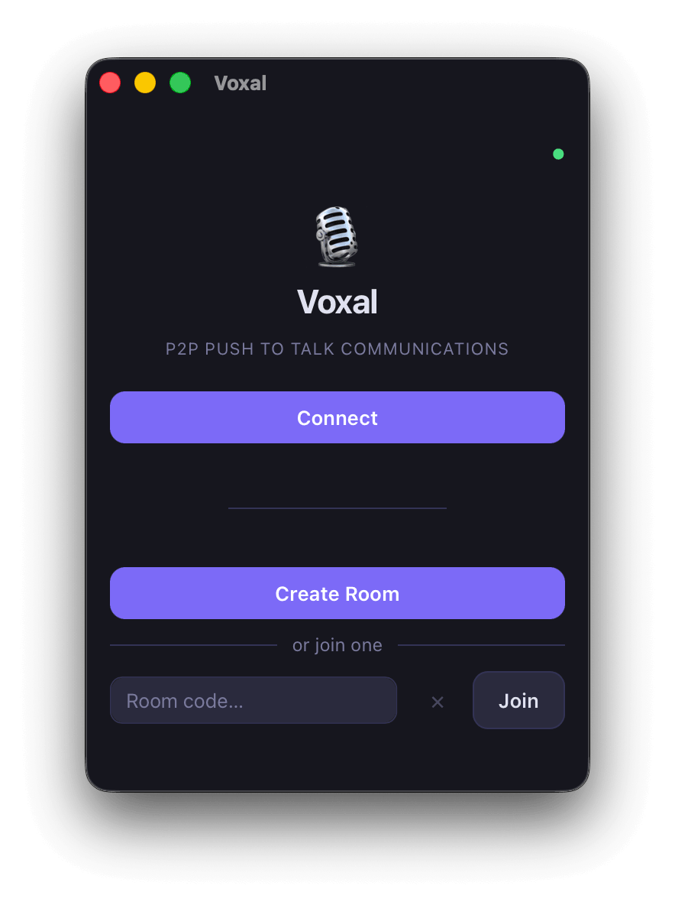
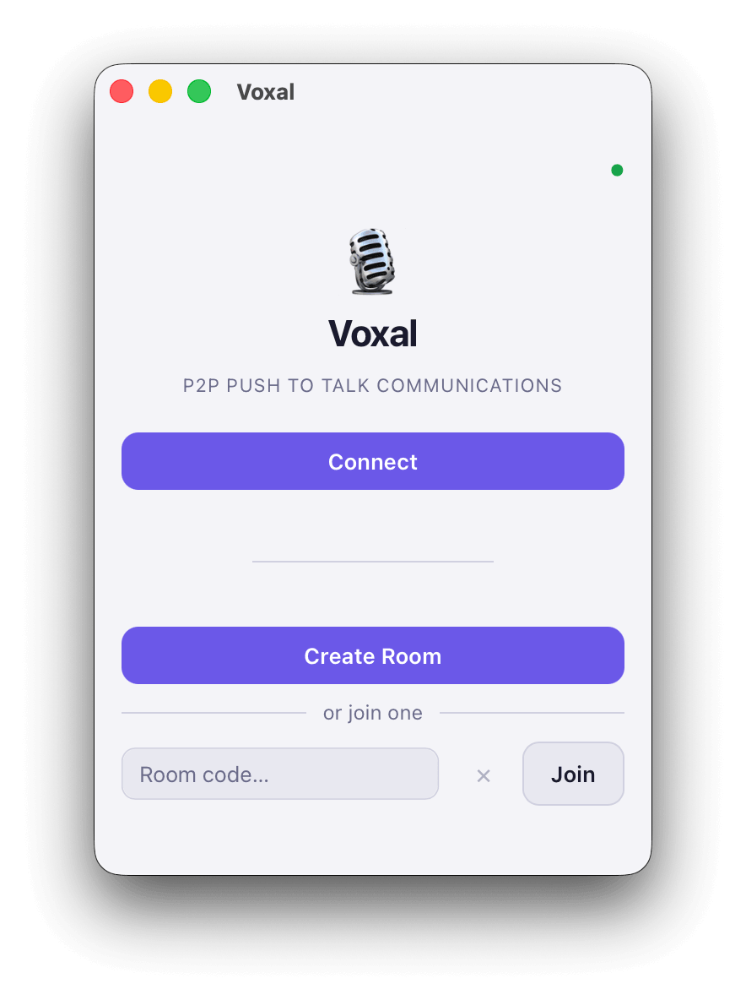

# Voxal

[](LICENSE)
[](https://github.com/ErwannRobin/Voxal/releases)
[](https://github.com/ErwannRobin/Voxal/actions/workflows/tests.yml)
<!-- coverage-badge -->
[](https://github.com/ErwannRobin/Voxal/actions/workflows/tests.yml)
<!-- /coverage-badge -->


Instant push-to-talk voice rooms.
<br>No accounts. No installation. No server required.

<details>
<summary>Screenshots</summary>

| Dark | Light |
|---|---|
|  |  |

</details>

## Get Started

🌐 [Try in a browser](https://web.voxal.app)

💻 [Download Desktop App](https://github.com/ErwannRobin/Voxal/releases/latest)

📡 [Join the Presence Portal](https://voxal.app)

## Why Voxal?

- **Pure P2P voice** (WebRTC full-mesh audio) — never routed through a media server, under any setting
- **Push-to-talk first** UX on every platform
- **Host migration** keeps rooms alive when the host leaves
- **No account required** to create or join rooms
- **No mandatory backend** (optional presence only)
- **Desktop + iOS + Android + Web** from one shared frontend
- **Open source** and **self-hostable signaling** for production control

## Features

### Voice

 - **Peer-to-peer voice conversation** - WebRTC audio mesh (Opus, 16 kHz mono)
 - **Push-to-talk with background mode** - Global shortcut on desktop; touch PTT on mobile/web; hands-free mode when you'd rather not hold anything
 - **Noise suppression** - RNNoise in a WebAssembly AudioWorklet, the browser/OS suppressor, or off — switchable mid-call
 - **Audio tuning** - Adjustable jitter buffer (adaptive or a fixed 0–500 ms), mic and speaker device pickers, and speaker/earpiece switching on mobile
 - **Echo test** - Hear your own outgoing audio, locally or round-tripped over the network, before you rely on it
 - **TURN / STUN support** - for [NAT/firewalls](https://en.wikipedia.org/wiki/Traversal_Using_Relays_around_NAT) traversal, with short-lived credentials minted for anonymous users ([details](docs/turn-and-ice.md))

### Video & screen sharing

 - **Video stage** - A real video layout that adapts to the room: tiles that reflow with the split, an overflow ribbon, a self-view you can park in any corner, on-tile camera flip, and an immersive full-screen stage on phones and the native apps
 - **Screen sharing** - Optional per participant (desktop/web; not on native mobile)
 - **Camera backgrounds** - Blur, four bundled presets, or your own image. Segmentation runs locally in WebAssembly on your own GPU — no frame is ever sent anywhere to compute it ([details](docs/video-effects.md))
 - **Optional SFU for video** - Camera and screen-share can route through Cloudflare's Realtime SFU once a room outgrows a comfortable mesh — the default past two participants, switchable to direct-only in Settings → Advanced. It applies to video only and never touches voice ([details](docs/video-routing.md))

### Rooms & platforms

 - **Room keep-alive via host migration** - Deputy/successor handoff with authoritative peer lists ([deep dive](docs/host-migration.md))
 - **Multi-platform support** - Web, macOS/Linux/Windows (Tauri), iOS/Android (Capacitor)
 - **Responsive everywhere** - Landscape web layout with a left/right-handed talk button; native apps stay portrait-locked
 - **Embeddable** - Drop a room into any page as an iframe, including a compact "tiny" mode with a `postMessage` bridge ([details](docs/iframe-embed.md))
 - **Optional presence** - Named channels and org rooms through the presence portal, with sign-in that works the same on web and native

### Diagnostics (dev mode)

 - **Device panel** - Per-participant OS, CPU, memory, battery, mic and link stats, filled natively on desktop where the WebView can't see them
 - **Remote log streaming** - Stream a peer's console to help debug, behind an explicit per-session consent prompt that auto-expires
 - **Network usage** - Live bandwidth broken down by voice, camera and screen, with a ten-minute history, in Settings → Advanced

### Experimental features

 - **Dynamic Island PTT (iOS)** - PushToTalkUI integration; requires a paid Apple Developer membership and is unverified on-device ([details](docs/mobile.md))

## What Makes Voxal Different?

Voxal combines push-to-talk simplicity with peer-to-peer resilience across desktop, mobile and web.

Most peer-to-peer voice applications stop working when the host disconnects.
<br>Voxal automatically elects a successor and keeps the room alive without reconnecting participants ([deep dive](docs/host-migration.md)).

And voice stays peer-to-peer permanently. A TURN relay only ever forwards opaque encrypted DTLS-SRTP; an SFU has to decrypt media to forward it selectively, which is why camera and screen-share may use one in larger rooms but **audio never does, under any setting** ([the distinction, in full](docs/video-routing.md)).

## Use Cases

- Gaming communities
- Remote teams and standups
- Event staff coordination
- Family voice rooms
- Temporary project channels
- Lightweight emergency communication

## Architecture Overview

```text
Signaling topology : star  (host ↔ peers via PeerJS DataConnection)
Audio topology     : mesh  (peer ↔ peer via WebRTC MediaConnection) — always, never server-routed
Video/screen       : mesh by default; optionally through Cloudflare's Realtime SFU
Codec              : Opus (16 kHz mono)
```

Room flow (high level):
1. Host creates a room (host PeerJS ID becomes the room join target).
2. Joiners connect to the host signaling channel and receive peer state.
3. Peers open direct audio links to each other.
4. Camera and screen-share form their own independent link sets, which `selectVideoTopology()` may route through the SFU instead.
5. If host disconnects, successor/deputy migration elects a new host without dropping active media links.

## Documentation

- [Architecture & protocol](docs/architecture.md)
- [Host migration deep dive](docs/host-migration.md)
- [Video routing — mesh vs. SFU, and why audio never relays](docs/video-routing.md)
- [Camera background effects](docs/video-effects.md)
- [TURN & ICE configuration](docs/turn-and-ice.md)
- [Deployment & self-hosting](docs/deployment.md)
- [Mobile build and fork guide (iOS/Android)](docs/mobile.md)
- [Release workflow and signing](docs/release.md)
- [Required checks — no merge on red tests](docs/required-checks.md)
- [iframe embed parameters and bridge](docs/iframe-embed.md)
- [Ring a friend — design proposal (not implemented)](docs/ring-a-friend.md)
- [Recent daily updates](docs/updates/2026-06-15.md)

## Contributing

[Contributions](https://github.com/ErwannRobin/Voxal/blob/main/CONTRIBUTING.md) are welcome. For local development:

```bash
git clone https://github.com/ErwannRobin/Voxal.git
make install
make dev
make test
```

If you modify files under `src/`, sync assets for mobile builds with `make cap-sync`.

| Command | What it does |
|---|---|
| `make install` | Installs Node deps and fetches Rust crates (with setup preflight checks) |
| `make dev` | Starts the Tauri desktop app with hot reload |
| `make run-web` | Serves the web app at `http://localhost:8080` |
| `make test` | Full suite: Rust type-check + Rust tests + API tests + Playwright E2E |
| `make test-e2e` | Fast Playwright E2E only (pure-logic and UI flows) |
| `make test-mesh` | Multi-peer WebRTC E2E against a real local PeerServer |
| `make coverage` | Rust + E2E + API coverage reports, summarised in one table |

`make test` is what CI gates on: `main` takes no merge whose tests are not green
([how that is enforced](docs/required-checks.md)). The multi-peer `make test-mesh`
suite is kept out of it so the fast path stays deterministic — run it when you
touch signaling, the audio mesh, or host migration.

## License

MIT - see [LICENSE](LICENSE).
